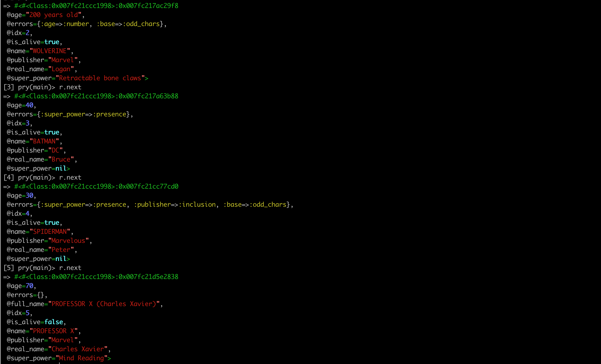

# Parxer

Parxer is another parser for xls, xlsx and csv files. But the big plus is that this ruby gem also has a nice DSL to help us with:

- Column mapping.
- File, row, and column/cell validation.
- Column/cell formatting.

## Installation

```bash
$ gem install parxer
```

Or add to your Gemfile:

```ruby
gem "parxer"
```

```bash
bundle install
```

## Usage

Imagine you have an `xls` file like this:


To parse this file you need to:

### 1 - Define your Parser using the DSL:

```ruby
class SuperheroesParser < Parxer::XlsParser
  validate_file(:rows_count, max: 50) # Define file validators

  column(:name, name: "Name") do # Map column names to attributes
    validate(:presence) # Add column validator
    format_with do
      value.upcase # Define custom formatters
    end
  end

  column(:real_name, name: "Real Name")

  column(:super_power, name: "Super Power") do
    validate(:presence)
  end

  column(:publisher, name: "Publisher") do
    validate(:inclusion, in: ["Marvel", "DC"])
  end

  column(:age, name: "Alive") do
    validate(:presence)
    validate(:number)
    format_with(:number, integer: true) # Use Parxer's formatter
  end

  column(:is_alive, name: "Alive", format: :boolean) do
    validate(:presence)
  end

  # Define validators to run after attribute validators
  validate_row(:odd_chars, if_valid: [:name, :real_name]) do
    (row.name + row.real_name).delete(" ").size.odd?
  end

  # Define callbacks
  after_parse_row do
    row.add_attribute(:full_name) # Add attributes dynamically
    row.full_name = "#{row.name} (#{row.real_name})" unless row.errors?
  end
end
```

### 2 - Initialize your parser:

```ruby
parser = SuperheroesParser.new
```

### 3 - Use your parser:

```ruby
result = parser.run("/some_path/superhero.xls"); #=> #<Enumerator: ...>
```

Now, if you iterate through each row of the enumerator you will get something like this:



As you can see...

1. Attributes like `name` or `is_alive` have been formatted.
2. Errors in the rows are accessible through the `errors` attribute.
3. `idx` attribute is the row number.
4. the custom `full_name` attribute was added as a part of the response.

For further information please go to the [Wiki](https://github.com/platanus/parxer/wiki)

## Testing

To run the specs you need to execute, **in the root path of the gem**, the following command:

```bash
bundle exec guard
```

You need to put **all your tests** in the `/my_gem/spec/` directory.

## Contributing

1. Fork it
2. Create your feature branch (`git checkout -b my-new-feature`)
3. Commit your changes (`git commit -am 'Add some feature'`)
4. Push to the branch (`git push origin my-new-feature`)
5. Create new Pull Request

## Credits

Thank you [contributors](https://github.com/platanus/parxer/graphs/contributors)!


Parxer is maintained by [platanus](http://platan.us).

## License

Parxer is © 2017 platanus, spa. It is free software and may be redistributed under the terms specified in the LICENSE file.
